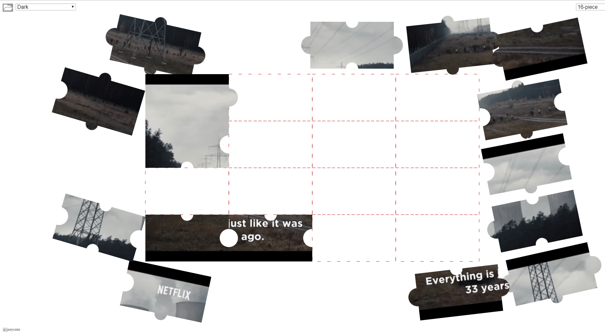

Wow, time has flown! Yet another [Netflix Hack Day](https://medium.com/netflix-techblog/netflix-hack-day-winter-2018-b36ee09699d6) has come to pass. For the Winter 2018 event, I decided to experiment with the combination of HTML5 Video and Canvas. The result of that effort is the Altered Video Player!

**AVP** is basically a video player that autogenerates a jigsaw puzzle from its source in real-time ( in this case a selected Netflix Original trailer.) 
To solve the puzzle, just rearrange the pieces by dragging and dropping them back onto the center grid. Difficulty can be adjusted in the top-right menu. 
You can also upload your own custom videos if you choose.

*Note: This hack was developed/tested primarily with the desktop version of Google Chrome ( experience may vary on other browsers )*

Click [here](http://gorch.com/hacks/avp/) to play!

