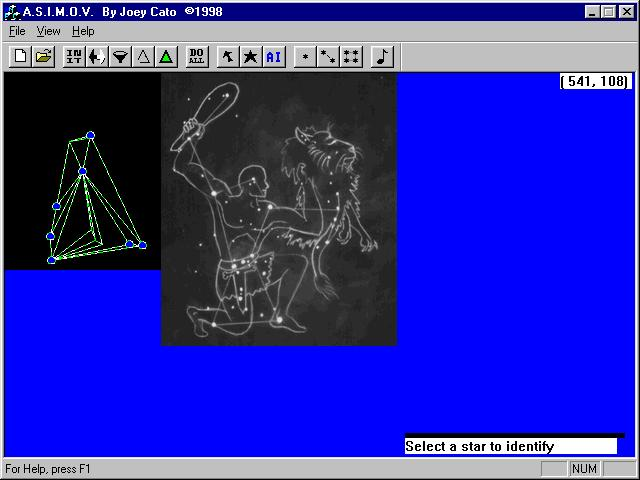

**A.S.I.M.O.V.** *(Automated Stellar Image Mapping & Object Visualization)* is a proof-of-concept expert system I created that imports bitmaps of the starry night, and then employs constellation recognition algorithms to identify them. 

To achieve accurate recognition I applied a series of programmatic filters to each image beforehand, then devised a
comparison algorithm which compared the triangle meshes of the star points.  By relying on the mathematic principle of similarity of triangles, I was able to find matches on sample photos, regardless of scale and orientation.

