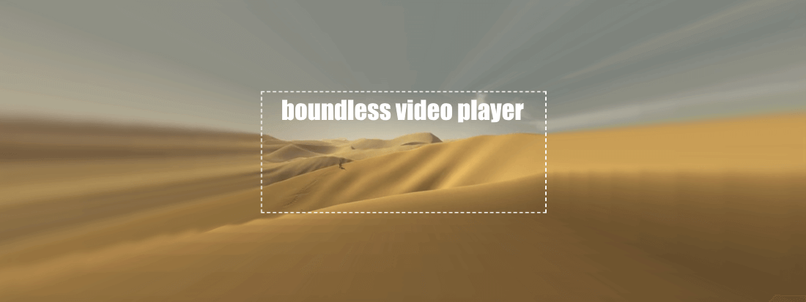

Today I released <b>boundless video player</b>, a side project I've been tinkering on over the fast few months:

https://github.com/joeycato/boundlessvideoplayer

Basically, it's a web app / video player that samples the edge pixels of a video in real-time and projects them outwards in 3D.

If you'd like to try it out yourself, here's the app link:

https://bvp.surge.sh/

Video of the app in action:

