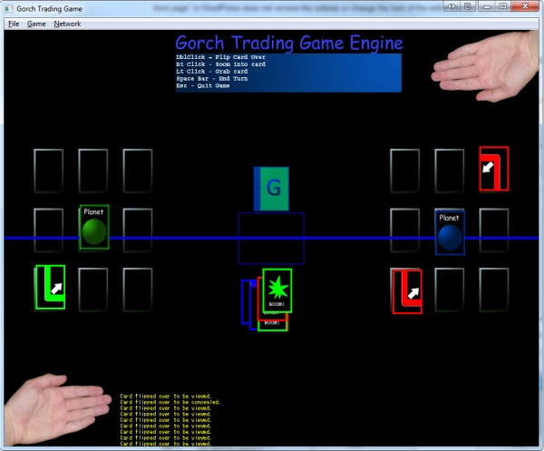

Back in 2003, I had an idea for a strategy-based space-themed card game. 

I wanted to playtest it originally with a paper prototype, but due to the fact that Ron, one of my strategy buff friends lived out of state I had to resort to an alternate plan. So I developed a network-based card game engine we could use to play the experimental game against each other. 

It worked out very well for us. Unfortunately, during the playtest process I learned that the game wasn't as fun as I'd imagined it be (basically the concept is to collect planets and build fortified shields around them before your opponent tries to attack.) As we played, I discovered it felt very imbalanced.

Anyway, the upshot was that the program worked very well in serving its purpose and I didn't need to waste any printer ink/paper. 

Also, because I designed the engine to be game-agnostic, I could use it to explore other new cardgame ideas, simply by modifying a directory of image and XML files.

