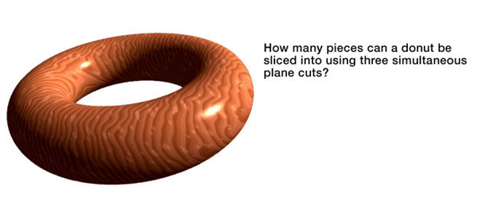
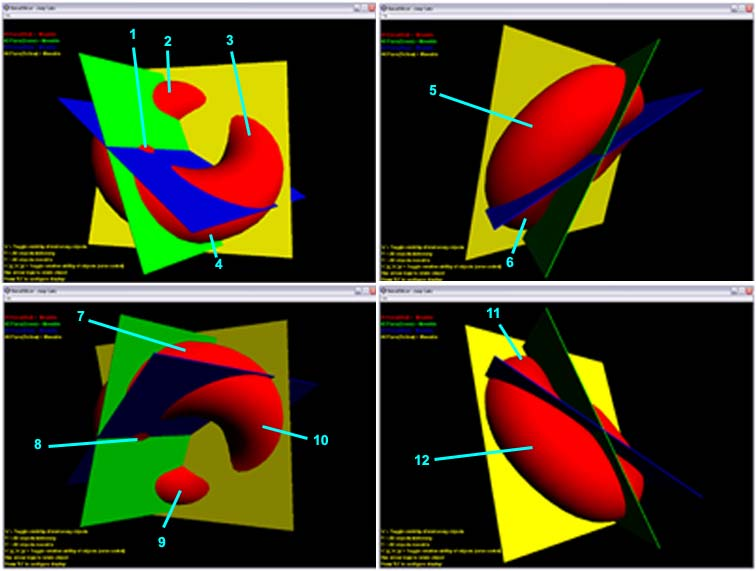

This project all started innocently enough with the following brain teaser:

The goal is to find the maximum possible number of pieces resulting from slicing a torus with three arbitrary planes. The inherent problem with this puzzle is that it can be conceptually difficult to reach optimal solutions without relying on a visual aid, which is why I decided to create the app. I also thought of it as a good opportunity to improve my Direct3D experience. What began as a casual pursuit quickly escalated into a Sunday coding frenzy.

Using this tool allowed me to reach a better solution (**12**) than what I originally estimated. Can you find more?

