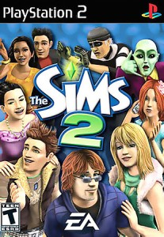

After nine exciting years working at EA, I decided it was time for a career change. 

Here's a list of all the industry titles I directly worked on as a software engineer contributing to *The Sims* team:

