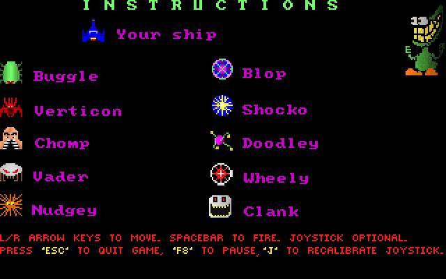

Your home planet Zardoff has been invaded by the evil overlord Vexx and your citizens depend on you to protect them. 

To win the game, you must survive 9 waves of enemy strikes.

This was my first shoot-em-up game. I had written it as a Galaga/Space Invaders clone. Each enemy ship has a very unique style of movement. To make the game-play challenging, the player would have to contend with multiple enemies at a time, requiring careful maneuvering of the ship.

Written in C, it originally evolved from MVPPaint's sample source code (bitmap rendering example) Incidentally, I also used MVPPaint to design all of the game art.

*Some trivia*: There really wasn't a Galactic Gorch 1. I just thought it would be amusing to name this as a
sequel ( after reading an article on how Larry Ellison similarly named his first version of database software as ORACLE 2 )

