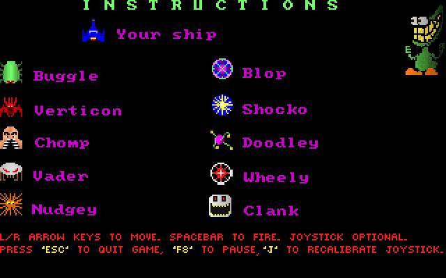
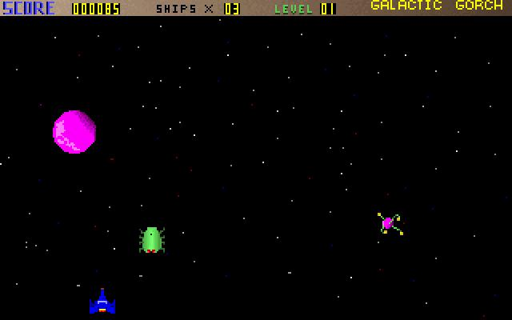

Your home planet Zardoff has been invaded by the evil overlord Vexx and your citizens depend on you to protect them. To win the game, you must survive 9 waves of enemy strikes.

This was my first shoot-em-up game. I had written it as a Galaga/Space Invaders clone. Each enemy ship has a very unique style of movement. To make the game-play challenging, the player would have to contend with multiple enemies at a time, requiring careful maneuvering of the ship.

Written in C, it originally evolved from MVPPaint’s sample source code (bitmap rendering example) Incidentally, I also used MVPPaint to design all of the game art.

