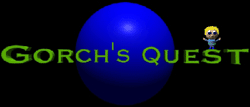
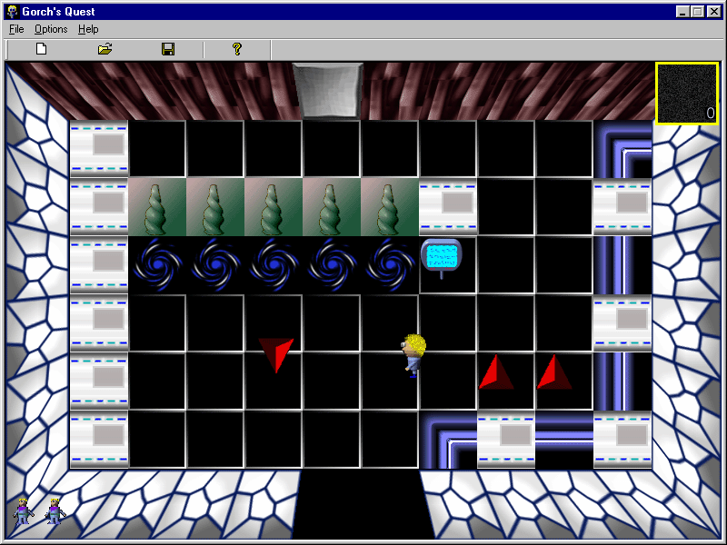

[Gorch’s Quest](http://gorch.com/games/gq/) is a tile-based space adventure game inspired by Legend of Zelda.

You are the young hero, Gorch, who must save his planet from the attack of an alien empire that indulges in galactic domination. To do so, you must navigate the catacombs of the Planetary Defense System that has been sabotaged. Find and return the five crystals to the main control room so that the defense system can be reactivated. Good Luck!

I learned a great deal while making this game. For example, I found that by creating the level editor as the very first step, it made it much easier to scope out and visualize the game world. This led me to quickly reconsider the game objects I had initially planned. Had I waited until later, it would have taken me much longer to complete the game. Also, I learned what not to do. By this, I’m referring to MFC/GDI which I used exclusively for the graphics and animations ( with the exception of OpenGL for the 3D rendered-walls ) I was able to mitigate some its performance issues by employing sprite-sheets, but things would have been much smoother in the long run with hardware-accelerated graphics.

Outside Credits: Thanks to Will McWhorter for composing the background music!

