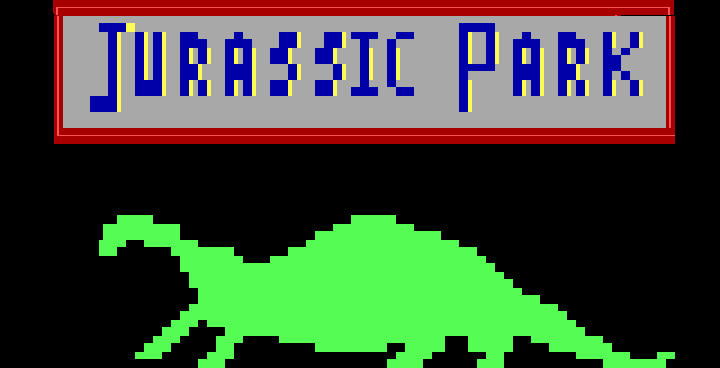
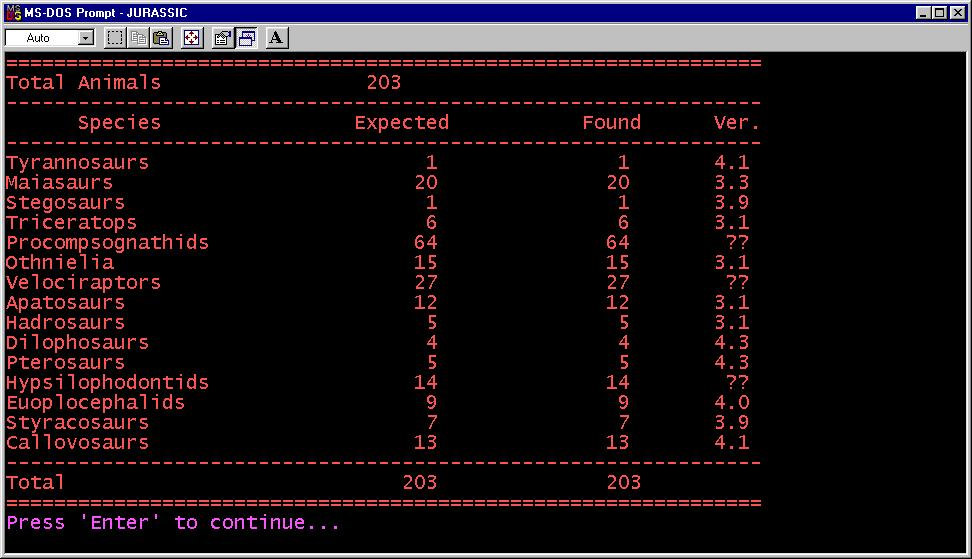

After reading Michael Crichton's Jurassic Park novel, I felt inspired to try and capture the experience with my own
game. 

To give you a bit of context, this was back in the early 1990's, when BBS (Bulletin Board Systems) ruled.  **JP:TA** *(Jurassic Park: Text Adventure)* was written as a BBS door application in C which I had been learning around that time. There weren't any graphics other than the ANSI title screen.

**JP:TA** was designed as a combat-centric RPG-lite game. The main goal was to explore the island as one of the book's characters and use your limited weapon arsenal to wipe out the remaining dinosaurs. It required a fairly simple strategy of  pursuing the weaker dinosaurs first, gradually building up your experience until you were ready to take on the final powerful T-Rex.

