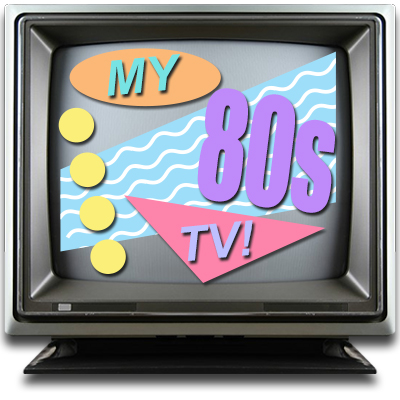

I’ve always been a huge 80’s nostalgia nut, so I decided honor the decade with my newest web project: My 80’s TV!

The basic goal of this project is to simulate the vintage experience of channel-surfing on a TV from the 80’s decade as much as possible. 

Each time you visit the site, the channels are randomized. In order to closely emulate the television watching
experience, the starting times of the videos are randomized as well. However, elapsed time is tracked, so if you flip back and forth between channels, it should resume at the correct time.

Recently I added genre filters, and my next goal is to extend them to include dates (1980-1989), since everyone has a different interpretation of the 80’s and so may only care about a specific year. Future plans for this app include support of other decades as well.

On the tech side, I used this project as an opportunity to learn more about jQuery and CSS transitions.

Click [here](http://my80stv.com) to check it out.

