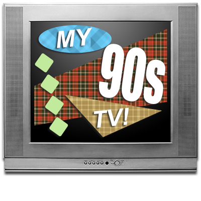

[My80sTV](http://my80stv.com) was a very  fun project and it received way more attention that I ever anticipated, so I naturally followed it up with a similar website that was equally nostalgic to me, My90sTV!

The biggest challenge and time sink came from the collection of all the clips. Even though I was able to automate much of the data collection this time, in the end I still manually curated each video to ensure it was correctly tagged with the appropriate year.  So it still remained a time-consuming process. After I was done, the database of clips was almost twice the size as the original My80sTV site! I haven’t decide what decade to pursue next, but it will likely be the 1960’s or 1970’s.

Click [here](http://my90stv.com) to check it out.

