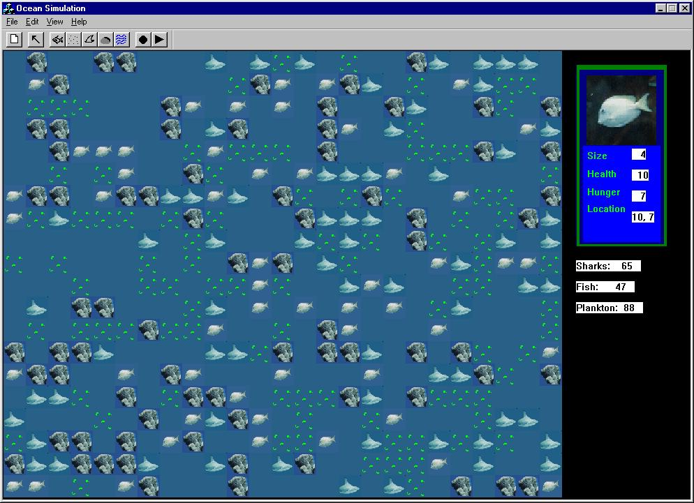

**Ocean95** is a pseudo-life simulation app. The operator may customize an ocean and monitor the interaction between fish, sharks, and plankton. 

The hook window feature allows closer inspection of the creatures. Ocean95 was developed during a team-training project. Personal contribution was overall design/code and full development of the GUI interface.

