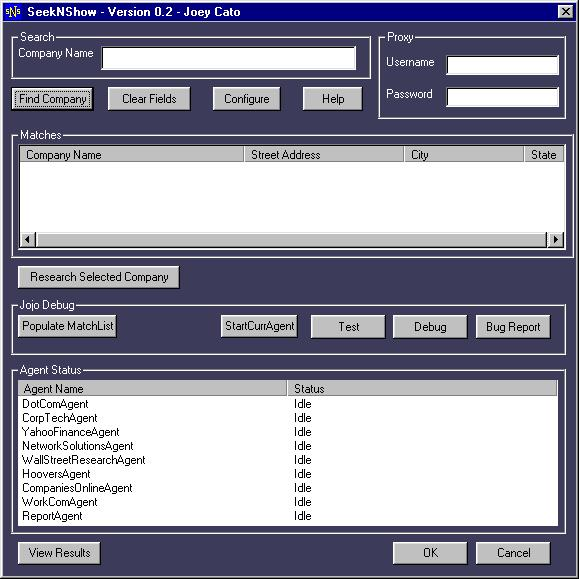

A multi-threaded intelligent agent app which simplifies the task of collecting public corporation information from the web. 

It simultaneously executes multiple queries in parallel and then synthesizes their results into a final HTML report.

Maintaining this app turned out to be quite the chore, as I discovered, since my web parsing code had to be updated constantly to reflect the constant changes on the various websites it sourced. 

In hindsight, I should have abstracted the parsing code into its own layer where it could be more robustly handled (via Perl or Python regular expressions)

