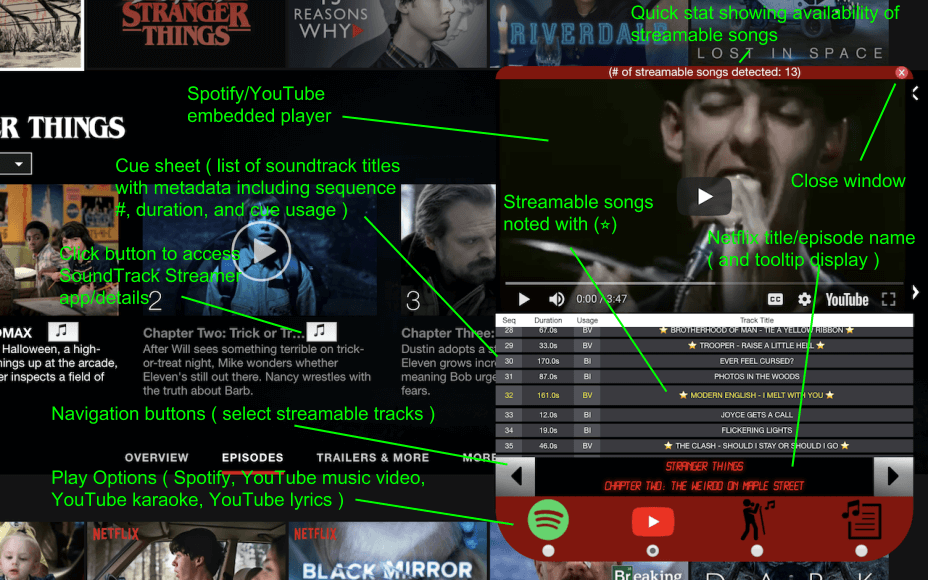

[Netflix Hack
Day - Fall 2018](https://medium.com/netflix-techblog/netflix-hack-day-fall-2018-c05dda4b98c1) recently 
passed and as always it was very fun to participate. I decided to use this occasion to build a ReactJS streaming app that connects
with a back-end database ( in this case PSQL )

<b>Soundtrack Streamer</b> is a Chrome browser extension that lets you access the soundtrack data from a Netflix-owned
title and directly stream its licensed songs using a variety of options: Spotify, Youtube ( music videos, karaoke, and
lyrics ) Special Thanks to the Amadeus team ( including Neha Kapoor and Nick Osztreicher ) for providing the data source
that made this hack possible! )

