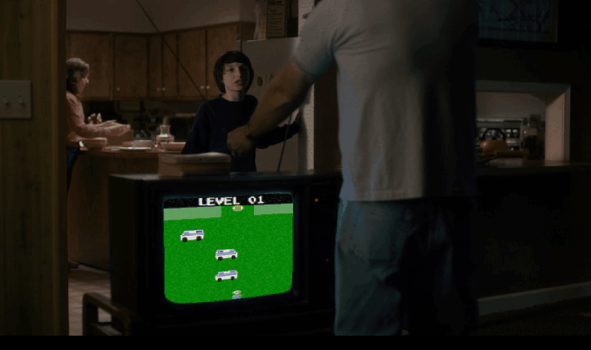

For my recent [Netflix Hack Day](http://techblog.netflix.com/2017/01/netflix-hack-day-winter-2017.html) project, I
wanted to create something based on [Stranger Things](https://www.netflix.com/title/80057281), a Netflix Original that debuted last year and quickly appealed to my interest in 80's nostalgia. 

Having seen a few [fan-based](http://www.strangerplay.com) [video](https://flixarcade.netflix.io/)
[games](https://infamousquests.itch.io/stranger-things) following its popular release, I felt equally inspired to make
some kind of video game contribution as well. It also interested me to design something in the process that was more
era-appropriate. Since our *Stranger Things* story begins in 1983, it seemed logical to aim for an [Atari 2600](https://en.wikipedia.org/wiki/Atari_2600_hardware) aesthetic. Even the show itself referenced Atari, so that was all the convincing I needed :)

In the end I decided to borrow game-play elements from [Frogger](https://en.wikipedia.org/wiki/Frogger) and
[Pacman](https://en.wikipedia.org/wiki/Pac-Man_(1982_video_game)) ( though the demon slugs were loosely inspired by the
Brain enemy's cruise missiles from [Robotron](http://www.atariprotos.com/5200/software/robotron/robotron.htm) Projecting the game screen onto the various TV sets was a bit of an afterthought ( I had recently noticed that the television set makes numerous appearances throughout the episodes, so I figured including them would improve the immersion. )

Just as I experienced with [MyDecadeTV](https://www.mydecadetv.com), this project was an absolute joy to work on. And I'm very grateful for the
[recent](https://www.cnet.com/news/play-netflixs-atari-style-stranger-things-video-game/) [attention](http://www.popularmechanics.com/culture/tv/a24990/stranger-things-game/)
it's [received](http://www.digitaltrends.com/gaming/netflix-stranger-things-atari-style-game/).

Click [here](http://strangergames.gorch.com) if you'd like to play *Stranger Games*.
  

