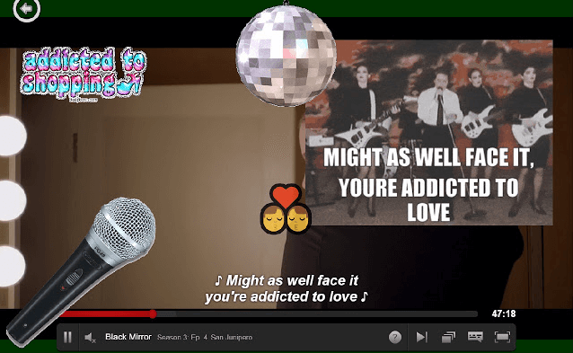
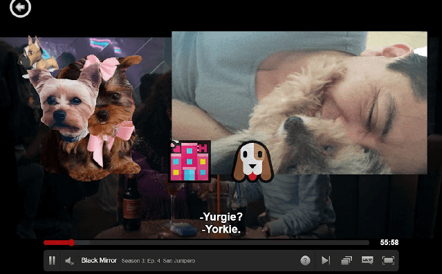

Netflix Hack Day is here again! For this experimental hack, we decided to add multiple visualizations to Netflix subtitles during playback. Each time a subtitle changes on-screen, we add the following

* Image stickers ( sourced by [GIPHY API](https://developers.giphy.com/) search’s top result )
* Emojis ( based on [moji-translate](https://www.npmjs.com/package/moji-translate) library )
* Mood colorization ( based on [AFINN sentiment](https://www.npmjs.com/package/sentiment) library )
* As a bonus, if we detect song lyrics a disco ball drops down from the top of the screen

