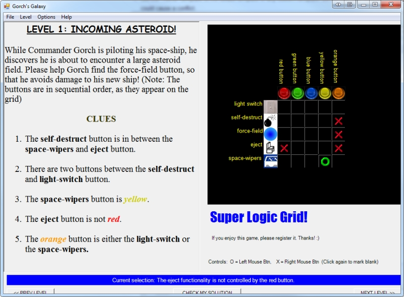

I've always been a fan of logic grid puzzles, but I never came across a video game that emulated it well. This was my attempt to do so, but my additional aim was to also make it more fun and intuitive. 

You can click on the grid with left or right mouse button to add O's and X's.Each time you select a tile, the status will update to reflect its logical translation. 

To make it more entertaining, each level was designed as a chapter in the story of Commander Gorch and his space adventures.

